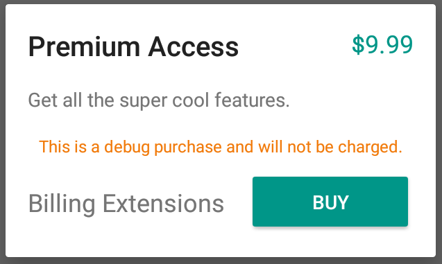

# BillingX: Billing Extensions

Extensions for the Android Billing Support library to allow fake purchases and transaction management in debug builds.



BillingX uses a local store for sku and purchase information, allowing you to use a `BillingClient` implementation to make purchases and query information without needing to connect to the Play Store. 

## Usage

Simply inject the `DebugBillingClient` instead of the standard `BillingClient` from the support library.  Then you can continue to use the `BillingClient` as you normally would.

If you're not using a dependency injection framework like [Dagger](), you can create a simple factory to get the appropriate instance. 

In `src/release/java`:

```kotlin
object BillingClientFactory {
  fun createBillingClient(activity: Activity, updateListener: PurchasesUpdatedListener): BillingClient {
    return BillingClient
        .newBuilder(activity)
        .setListener(updateListener)
        .build()
  }
}
```

In `src/debug/java`:

```kotlin
object BillingClientFactory {
  fun createBillingClient(activity: Activity, updateListener: PurchasesUpdatedListener): BillingClient {
    return DebugBillingClient(
        activity = activity,
        backgroundExecutor = Executors.diskIO,
        purchasesUpdatedListener = updateListener
    )
  }
}
```

### Initializing Inventory

Before you can make purchases or view products with the debug billing client you need to initialize your inventory.  You can do this using the BillingStore:

```kotlin
fun setupPurchases(activity: Activity) {
  BillingStore.getInstance(activity)
      .clearProducts()
      .addProduct(
          SkuDetailsBuilder(sku = "com.myapp.weekly", type = BillingClient.SkuType.SUBS,
              price = "$3.99", priceAmountMicros = 3990000, priceCurrencyCode = "USD",
              title = "Weekly", description = "Weekly Premium Subscription",
              subscriptionPeriod = "P1W", freeTrialPeriod = "P1W").build()
      )
      .addProduct(
          SkuDetailsBuilder(sku = "com.myapp.monthly", type = BillingClient.SkuType.SUBS,
              price = "$8.99", priceAmountMicros = 8990000, priceCurrencyCode = "USD",
              title = "Monthly", description = "Monthly Premium Subscription",
              subscriptionPeriod = "P1W", freeTrialPeriod = "P1W").build()
      )
      .addProduct(
          SkuDetailsBuilder(sku = "com.myapp.yearly", type = BillingClient.SkuType.SUBS,
              price = "$59.99", priceAmountMicros = 59990000, priceCurrencyCode = "USD",
              title = "Yearly", description = "Yearly Premium Subscription",
              subscriptionPeriod = "P1W", freeTrialPeriod = "P1W").build()
      )
}
```

## Download

Clone the repo...

Import the billingx library only into your debug builds and use the standard billing support library in your release builds. 

```groovy
debugImplementation project(":billingx")
releaseImplementation 'com.android.billingclient:billing:1.0'
```

## License

```
Copyright 2018 Ryan Harter.

Licensed under the Apache License, Version 2.0 (the "License");
you may not use this file except in compliance with the License.
You may obtain a copy of the License at

   http://www.apache.org/licenses/LICENSE-2.0

Unless required by applicable law or agreed to in writing, software
distributed under the License is distributed on an "AS IS" BASIS,
WITHOUT WARRANTIES OR CONDITIONS OF ANY KIND, either express or implied.
See the License for the specific language governing permissions and
limitations under the License.
```